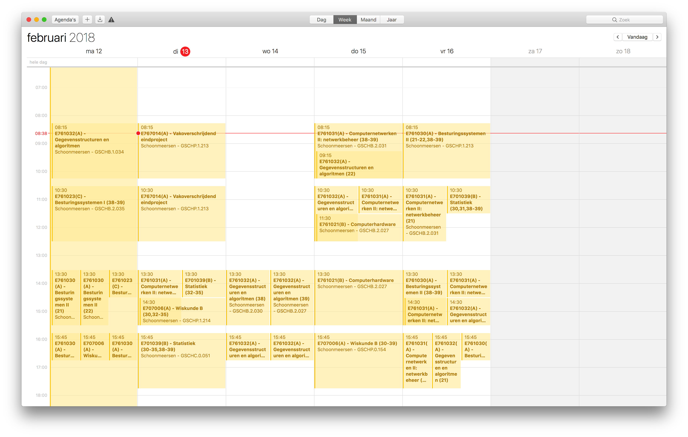
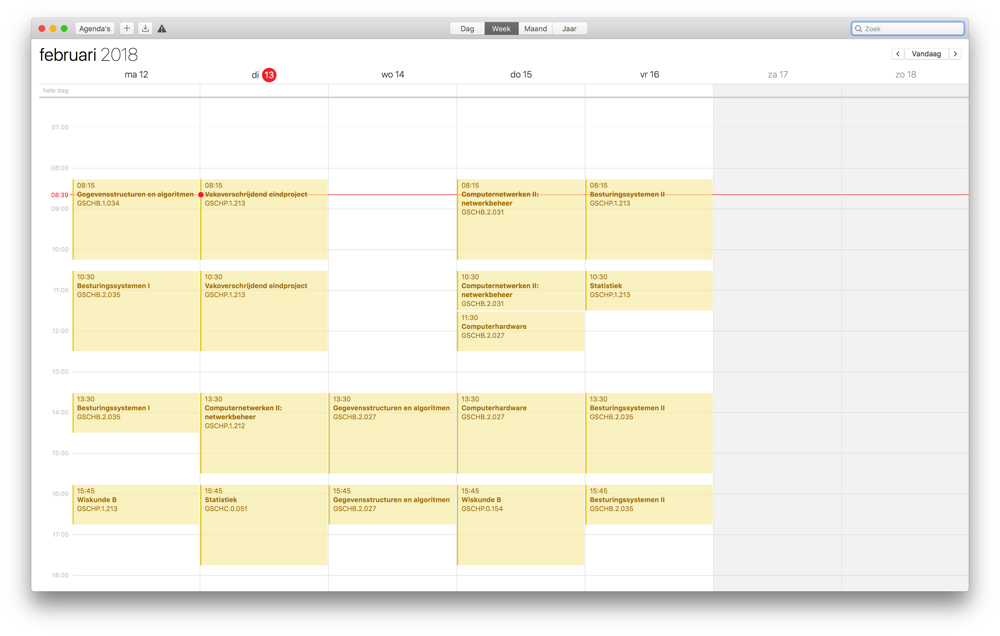
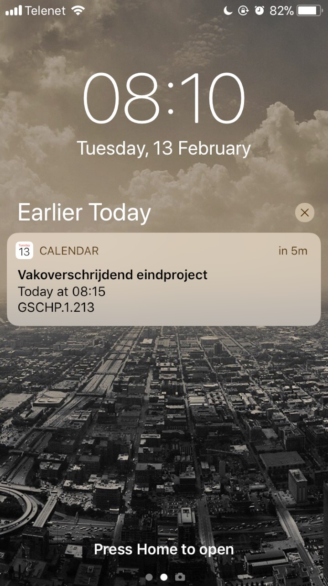

# ugent-cal

This project offers a personal iCal file for your personal Minerva account.

- 15 minutes before a lesson you'll receive an alarm.
- The iCal file synces every hour with Minerva.
- You can specify your class group, so you don't see other classes.

## Example
If you're following the Bridging Programme Master of Science in Industrial Engineering: informatics, and you're in group 39 you can subscribe to following iCal link: [https://ugent-ical.dem.be/cal.ics](https://ugent-ical.dem.be/cal.ics)

### Before (iCal from Minerva)


### After


### Alarm


## Installation
### Requirements

- php  (>=7.1.3)
- composer

### Installation

To run the API locally, you'll need to install the dependencies using composer.
```bash
composer install
```

When everything is installed, the environment variables need to be declared. Copy your .env.example to .env and fill in your settings.
```bash
cp .env.example .env

php artisan key:generate
```

There are multiple ways to run it. You can simply serve it with
```bash
php artisan serve
```